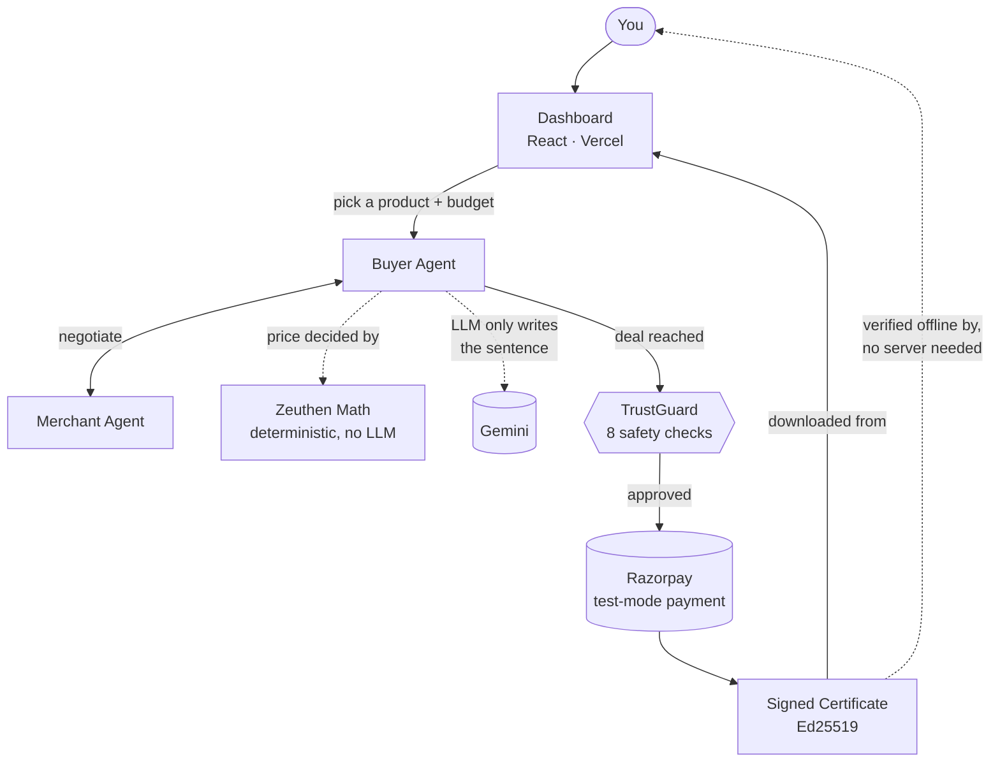
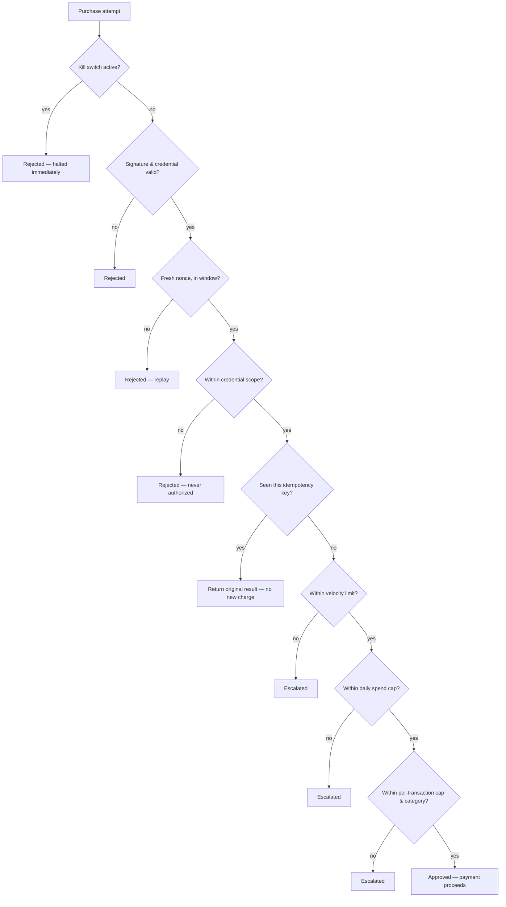

<div align="center">

# Setu

**Two AI agents negotiate a real price and pay for it — and can prove, cryptographically, that they played fair.**

*A buildathon project, not affiliated with any existing company or product also named "Setu."*

[](https://setu-alpha-beige.vercel.app)
[](https://setu-59l6.onrender.com/health)
[](docs/TESTING.md)
[](LICENSE)

[Live demo](https://setu-alpha-beige.vercel.app) · [Architecture](docs/ARCHITECTURE.md) · [Threat model](docs/THREAT_MODEL.md) · [Bargaining strategy](docs/BARGAINING.md)

<br>


</div>

---

## What this is

Most "AI negotiates for you" demos are smoke and mirrors: an LLM freestyles a number, or you're just asked to trust that it's safe. Setu tries to actually earn that trust instead.

- **The price is math, not a guess.** A Buyer Agent and a Merchant Agent negotiate using Zeuthen's concession protocol — real game theory, fully deterministic. The LLM only turns each round's already-decided offer into a sentence for the chat log. It never touches the price. → [`docs/BARGAINING.md`](docs/BARGAINING.md)
- **Every purchase passes through 8 safety checks** before any money moves — kill switch, signature/replay defense, credential scope, idempotency, velocity limits, daily spend cap, per-transaction cap, category policy. All 8 have been fired against the *live production deployment*, not just tested locally. → [`docs/THREAT_MODEL.md`](docs/THREAT_MODEL.md)
- **The payments are real.** Razorpay test-mode transactions, not a mock.
- **You get a receipt you don't have to trust us on.** A completed purchase can produce a signed certificate you verify yourself, offline. → [Verification certificates](#verification-certificates)

## Why it's different

| | The usual "AI negotiates" demo | Setu |
|---|---|---|
| Who sets the price | The LLM, freestyling | A deterministic bargaining engine — reproducible, never hallucinated |
| What the LLM is trusted with | Everything, including the number | One sentence of flavor text. A broken LLM call degrades the chat log, never the price |
| How "safe" is proven | Take our word for it | 8 trust checks, fired live against production, with the request/response evidence to show for it |
| How a completed deal is proven | A database row you have to trust us about | A signed certificate you can verify **offline**, with no call back to our server |

## See it live

<p align="center">
  
</p>

**[setu-alpha-beige.vercel.app](https://setu-alpha-beige.vercel.app)** — pick a product and a budget, or just hit "Surprise me." Your own Buyer Agent negotiates against Setu's Merchant Agent in real time: a two-party chat paced by real LLM latency, a live risk-of-conflict chart, and — once a deal closes — a real Razorpay Checkout you complete yourself.

<p align="center">
  
</p>

Three more tabs, all built from real data — nothing illustrative:

<p align="center">
  
</p>

- **Decision trace** — the exact 8-step checklist behind one outcome, pulled straight from the backend's own response.
- **Test results** — a 22-scenario, 37-call test harness, run against the live API, deliberate rule-breaks included.
- **Audit log** — every one of those 37 calls, with real order numbers, timestamps, durations.
- **Kill switch** — an actual admin-gated emergency stop, wired into the live deployment. Not a demo toggle.

## Verification certificates

<p align="center">
  
</p>

When a negotiated purchase completes, you get a **"Download verification certificate"** button. It saves a small signed JSON file: product, price, transaction id, timestamp, and exactly which trust checks that transaction passed — signed with the same Ed25519 key the backend already uses for agent credentials.

The point is simple: **you don't have to trust our server to check it.** [`verify_certificate.py`](verify_certificate.py) verifies the signature completely offline — no network call, nothing that depends on us being honest or even online.

Here's real output, from an actual completed purchase, a real human clicking through a real Razorpay Checkout — not a staged example:

```bash
python verify_certificate.py path/to/certificate.json
```

```
Issuer:          setu-platform
Transaction ID:  pay_TY6AQ50iNNS6nZ
Product:         Mechanical Keyboard — Hot-swap, 65% (mechanical-keyboard-65)
Agreed price:    ₹3,499.00
Issued at:       2026-09-04T20:53:59.900620+00:00

✓ Valid — this certificate has not been altered
```

Change one character in that same file and run it again:

```
✗ Invalid — signature does not match
```

## Architecture



In one sentence: you pick a product and budget, your Buyer Agent negotiates with the Merchant Agent using deterministic math (the LLM just phrases it — never sets the price), TrustGuard checks the deal, a real Razorpay payment goes through, and you get back a certificate you can verify yourself without trusting us at all.

Want the deeper diagrams — component call sequence, raw data flow, deployment topology? → [`docs/ARCHITECTURE.md`](docs/ARCHITECTURE.md)

## Tech stack

| Layer | Choice |
|---|---|
| Backend | Python, FastAPI, Pydantic, `uvicorn` — deployed on Render |
| Frontend | React 18, Tailwind CSS, Framer Motion — deployed on Vercel |
| Payments | Razorpay test-mode (Orders + Payments API) |
| LLM | Gemini (free tier), behind a provider-agnostic interface — phrasing and bounded upsell copy only, never the negotiated price |
| Crypto | `cryptography` (Ed25519) — agent identity, credentials, and transaction certificates all share one signing convention |
| Testing | `pytest`, `hypothesis`, a black-box HTTP scenario harness run against the live production API |

## Quickstart

```bash
git clone <this-repo>
cd setu
cp .env.example .env   # fill in Razorpay test keys + Gemini API key
make install
make test               # run the backend test suite (140 tests)
make run                 # start the FastAPI backend on :8001
make demo               # end-to-end Razorpay test-mode payment (needs real keys in .env)
```

Frontend dev server (separate terminal):

```bash
cd frontend && npm install && npm run dev   # :5173
```

Verify a downloaded certificate (no server, no install beyond `requirements.txt`):

```bash
python verify_certificate.py path/to/certificate.json
```

## Project structure

```
backend/app/
  buyer_agent/       Buyer Agent: product matching, negotiation, payment
  merchant_agent/     Merchant Agent: x402 quotes, upsells, payment verification
  bargaining/         Zeuthen bargaining engine — pure, deterministic, no LLM
  trust/              TrustGuard: identity, credentials, policy, velocity,
                       idempotency, daily spend, kill switch
  x402/                Razorpay-adapted x402 protocol subset
  llm/                 Provider-agnostic LLM client + latency/cost logging
  certificate.py       Signed transaction certificates
  checkout_quote.py    Short-lived signed tokens binding a negotiated price
                       to a real Razorpay Checkout order
  scripts/              Scenario test harness, local demo scripts
frontend/src/
  components/          Dashboard: hero, live negotiation feed, chat replay,
                       decision trace, kill switch, audit log
  lib/                  Shared formatting/classification helpers
verify_certificate.py  Standalone, offline certificate verifier
docs/                   Architecture, threat model, bargaining strategy,
                       protocol spec, deployment, testing, decision log
```

## Trust layer, in one picture



Checked in exactly this order, every time — the first failure stops everything, no partial approvals. All of it has been fired against the live production deployment, with the real request/response transcripts in [`BUILD_LOG.md`](BUILD_LOG.md) and summarized in [`docs/THREAT_MODEL.md`](docs/THREAT_MODEL.md).

## Testing & live verification

- `pytest backend/tests -v` → **140/140 passing** locally.
- A black-box scenario harness (`backend/app/scripts/scenario_harness.py`) ran 22 named scenarios, 37 real HTTP calls, against the **live production API** — comfortable-budget purchases, tight-budget negotiations, graceful no-match failures, and deliberate rule-breaks (credential scope, velocity, daily spend, duplicate idempotency keys). Results live in `backend/app/scripts/harness_results/*.jsonl` and show up in the dashboard's Test Results/Audit Log tabs.
- Every trust rule has been independently fired against production with real evidence, not just asserted in a unit test. Full transcripts in [`BUILD_LOG.md`](BUILD_LOG.md); how to reproduce in [`docs/TESTING.md`](docs/TESTING.md).

## Known limitations

Being upfront, since this was built fast:

- Single instance, in-memory trust-layer state — no shared store like Redis/Postgres yet, so it wouldn't survive scaling past one process today.
- The negotiation engine sees both parties' reservation prices in one process, rather than each agent inferring the other's from observed offers alone. See "What this does not model" in [`docs/BARGAINING.md`](docs/BARGAINING.md).
- The admin kill switch uses one shared static key — fine for a single-operator demo, not for a real deployment with multiple operators.
- Test-mode payments only. Live-mode is structurally supported but intentionally blocked in code (`config.py`).

Full, continuously-updated list: [`docs/THREAT_MODEL.md`](docs/THREAT_MODEL.md) → "Known gaps."

## Docs

- [`docs/ARCHITECTURE.md`](docs/ARCHITECTURE.md) — system overview, component & data-flow diagrams, deployment topology
- [`docs/THREAT_MODEL.md`](docs/THREAT_MODEL.md) — assets, threats, defenses, live-verification evidence
- [`docs/BARGAINING.md`](docs/BARGAINING.md) — the Zeuthen strategy, in full, with the actual math
- [`docs/PROTOCOL.md`](docs/PROTOCOL.md) — the x402 subset, in detail
- [`docs/DEPLOYMENT.md`](docs/DEPLOYMENT.md) — how it's deployed
- [`docs/TESTING.md`](docs/TESTING.md) — how to run and reproduce every test
- [`docs/DECISIONS.md`](docs/DECISIONS.md) — a running log of non-obvious decisions and why
- [`BUILD_LOG.md`](BUILD_LOG.md) — the full day-by-day build log, including every live-verification transcript

## License

MIT — see [`LICENSE`](LICENSE).
