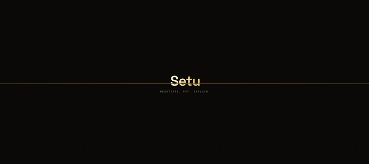
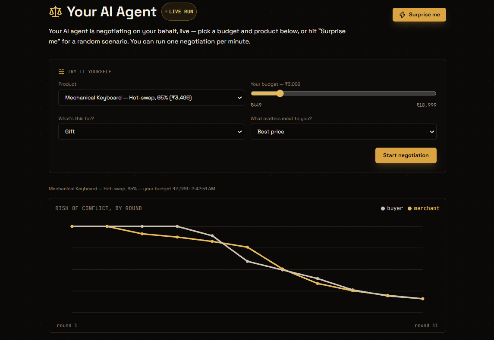
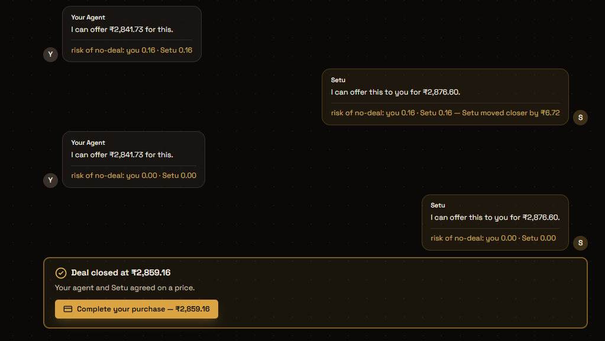
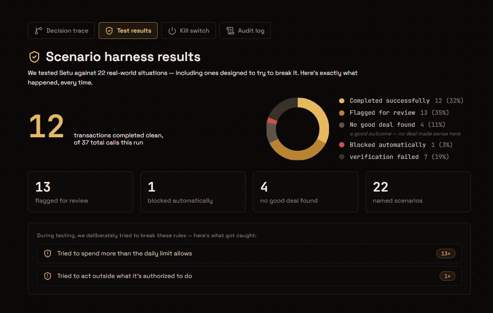
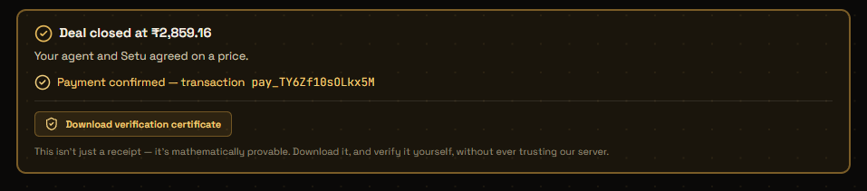
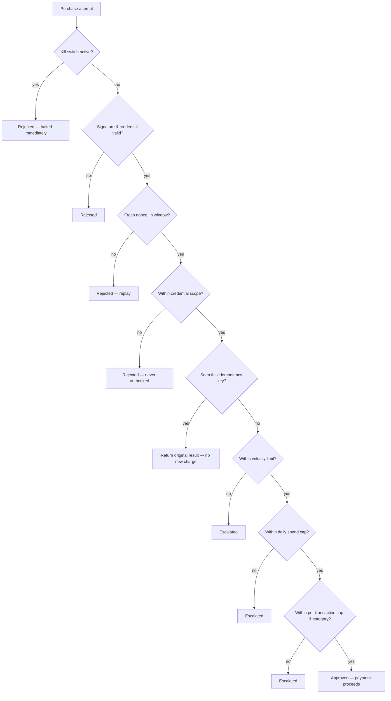

<div align="center">

# Setu

### AI agents that negotiate a real price, pay real money, and prove — cryptographically — that they played fair.

**No LLM freestyling a number. No "trust us, it's safe." Just deterministic math, live-verified security, and a signed receipt you can check yourself.**


*A buildathon project — not affiliated with any existing company or product also named "Setu."*

[](https://setu-alpha-beige.vercel.app)
[](https://setu-59l6.onrender.com/health)
[](docs/TESTING.md)
[](LICENSE)

[Live demo](https://setu-alpha-beige.vercel.app) · [Architecture](docs/ARCHITECTURE.md) · [Threat model](docs/THREAT_MODEL.md) · [Bargaining strategy](docs/BARGAINING.md)

<br>



</div>

---

## What this is

- **The price is math, not a guess.** A Buyer Agent and a Merchant Agent negotiate using Zeuthen's concession protocol — deterministic game theory. The LLM only phrases the sentence, never sets the number. → [`docs/BARGAINING.md`](docs/BARGAINING.md)
- **8 safety checks, every purchase, no exceptions.** Kill switch, signature/replay defense, credential scope, idempotency, velocity limits, daily spend cap, per-transaction cap, category policy — all fired live against **production**, not just tested locally. → [`docs/THREAT_MODEL.md`](docs/THREAT_MODEL.md)
- **Real payments.** Razorpay test-mode transactions. Not a mock.
- **A receipt you don't have to trust us on.** Every completed purchase can produce a signed certificate, verifiable offline. → [Verification certificates](#verification-certificates)

## Why it's different

| | The usual "AI negotiates" demo | Setu |
|---|---|---|
| **Who sets the price** | The LLM, freestyling | Deterministic bargaining engine — reproducible, never hallucinated |
| **What the LLM touches** | Everything, including the number | One sentence of flavor text — never the price |
| **How "safe" is proven** | Take our word for it | 8 checks, fired live against production, real evidence attached |
| **How a deal is proven** | A database row you trust us on | A signed certificate, verified **offline**, no call back to us |

## How the negotiation actually works

**The core idea:** both agents track a "risk of no deal" score every round, and whoever has less to lose by giving in does. That's Zeuthen's monotonic concession protocol — decades-old game theory, not LLM improvisation.

Walking through the exact run shown above (Mechanical Keyboard, list price ₹3,499, your budget ₹3,099):

- **Both sides have a limit, kept private.** The buyer won't go past budget; the merchant won't sell below its floor. Only offers get exchanged — never the limits themselves.
- **Each round, both ask: "what would caving right now cost me?"** That's the risk score. Whoever's risk is *lower* concedes — they have less to protect.
- **Concessions scale with stubbornness.** A more stubborn opponent gets met with a bigger step, not a fixed increment — which is why the risk chart's two lines visibly converge.
- **It stops once the gap stops mattering** (1% of list price), not at the literal last paisa. This run: 11 rounds, closed at ₹2,859.16.
- **A real stalemate ends as "no deal,"** not a forced number. If both sides are pinned at their limit with a gap left, that's it.

The LLM's *only* job: turning "buyer offers 2841.73, risk 0.16" into *"I can offer ₹2,841.73 for this."* for the chat log. If that call fails, a templated sentence fills in — the negotiation never notices.

Full math → [`docs/BARGAINING.md`](docs/BARGAINING.md)

## See it live

<p align="center">
  
</p>

**[setu-alpha-beige.vercel.app](https://setu-alpha-beige.vercel.app)**

- Pick a product and a budget, or hit **"Surprise me."**
- Watch your own Buyer Agent negotiate against Setu's Merchant Agent, live.
- A two-party chat, paced by real LLM latency, plus a live risk-of-conflict chart.
- Once a deal closes: a real Razorpay Checkout, which you complete yourself.
  - **Test-mode card:** `4100 2800 0000 1007` (domestic — Razorpay's international test BINs get declined on this account) · any future expiry · any 3-digit CVV · any 4-10 digit OTP when prompted — no real money moves.

<p align="center">
  
</p>

**Three more tabs, all real data, nothing illustrative:**

<p align="center">
  
</p>

- **Decision trace** — the exact 8-step checklist behind one outcome, straight from the backend's response.
- **Test results** — 22 scenarios, 37 real calls, run against the live API, deliberate rule-breaks included.
- **Audit log** — all 37 of those calls, with real order numbers, timestamps, durations.
- **Kill switch** — an actual admin-gated emergency stop, wired into the live deployment.

## Verification certificates

<p align="center">
  
</p>

- **Every completed purchase gets a "View certificate" and a "Download verification certificate" button.**
- **View certificate** opens a readable certificate card — product, price, transaction id, issued date, and the trust checks passed — rendering the exact same signed data the download produces, just formatted for a human.
- **Download** saves that same data as a signed JSON file: product, price, transaction id, timestamp, and exactly which trust checks passed.
- Signed with the same Ed25519 key the backend already uses for agent credentials — nothing new.
- **You never have to trust our server to check it.** [`verify_certificate.py`](verify_certificate.py) verifies the signature completely offline — no network call, nothing that depends on us being honest or even online.

Real output, from a real completed purchase — a real human clicking through a real Razorpay Checkout:

```bash
python verify_certificate.py path/to/certificate.json
```

```
Issuer:          setu-platform
Transaction ID:  pay_TY6AQ50iNNS6nZ
Product:         Mechanical Keyboard — Hot-swap, 65% (mechanical-keyboard-65)
Agreed price:    ₹3,499.00
Issued at:       2026-09-04T20:53:59.900620+00:00

✓ Valid — this certificate has not been altered
```

Change one character in that same file and run it again:

```
✗ Invalid — signature does not match
```

## Architecture


- **You** pick a product and budget.
- Your **Buyer Agent** negotiates with the **Merchant Agent** using deterministic math — the LLM just phrases it.
- **TrustGuard** checks the deal, a real **Razorpay** payment goes through.
- You get back a **certificate** you verify yourself, offline, trusting nothing.

Deeper diagrams (component call sequence, raw data flow, deployment topology) → [`docs/ARCHITECTURE.md`](docs/ARCHITECTURE.md)

## Tech stack

| Layer | Choice |
|---|---|
| **Backend** | Python, FastAPI, Pydantic, `uvicorn` — deployed on Render |
| **Frontend** | React 18, Tailwind CSS, Framer Motion — deployed on Vercel |
| **Payments** | Razorpay test-mode (Orders + Payments API) |
| **LLM** | Gemini (free tier) — phrasing + bounded upsell copy only, never the price |
| **Crypto** | `cryptography` (Ed25519) — one signing convention for identity, credentials, and certificates |
| **Testing** | `pytest`, `hypothesis`, a black-box HTTP scenario harness run against production |

## Quickstart

```bash
git clone <this-repo>
cd setu
cp .env.example .env   # fill in Razorpay test keys + Gemini API key
make install
make test               # run the backend test suite (141 tests)
make run                 # start the FastAPI backend on :8001
make demo               # end-to-end Razorpay test-mode payment (needs real keys in .env)
```

Frontend dev server (separate terminal):

```bash
cd frontend && npm install && npm run dev   # :5173
```

Verify a downloaded certificate (no server, no install beyond `requirements.txt`):

```bash
python verify_certificate.py path/to/certificate.json
```

## Project structure

```
setu/
├── backend/app/
│   ├── buyer_agent/       — Buyer Agent: product matching, negotiation, payment
│   ├── merchant_agent/    — Merchant Agent: x402 quotes, upsells, payment verification
│   ├── bargaining/        — Zeuthen bargaining engine, pure & deterministic, no LLM
│   ├── trust/             — TrustGuard: identity, credentials, policy, velocity,
│   │                         idempotency, daily spend, kill switch
│   ├── x402/              — Razorpay-adapted x402 protocol subset
│   ├── llm/               — Provider-agnostic LLM client + latency/cost logging
│   ├── scripts/           — Scenario test harness, local demo scripts
│   ├── certificate.py     — Signed transaction certificates
│   └── checkout_quote.py  — Short-lived signed tokens binding a negotiated price
│                             to a real Razorpay Checkout order
│
├── frontend/src/
│   ├── components/        — Dashboard: hero, live negotiation feed, chat replay,
│   │                         decision trace, kill switch, audit log
│   └── lib/                — Shared formatting/classification helpers
│
├── docs/                   — Architecture, threat model, bargaining strategy,
│                             protocol spec, deployment, testing, decision log
│
└── verify_certificate.py  — Standalone, offline certificate verifier
```

## Trust layer, in one picture



**Checked in this exact order, every time — first failure stops everything.** No partial approvals. Every rule fired live against production: transcripts in [`BUILD_LOG.md`](BUILD_LOG.md), summary in [`docs/THREAT_MODEL.md`](docs/THREAT_MODEL.md).

## Testing & live verification

- **`pytest backend/tests -v` → 141/141 passing** locally.
- **A black-box scenario harness** (`backend/app/scripts/scenario_harness.py`) ran 22 scenarios, 37 real calls, against the **live production API** — comfortable purchases, tight-budget negotiations, no-match failures, deliberate rule-breaks. Results in `backend/app/scripts/harness_results/*.jsonl`, surfaced live in the Test Results/Audit Log tabs.
- **Every trust rule independently fired against production**, real evidence attached, not just a unit-test assertion. Transcripts in [`BUILD_LOG.md`](BUILD_LOG.md); how to reproduce in [`docs/TESTING.md`](docs/TESTING.md).

## Known limitations

Being upfront, since this was built fast:

- **Single instance, in-memory trust state** — no shared store like Redis/Postgres yet, won't survive scaling past one process today.
- **Negotiation math runs in one process** — both parties' limits live together rather than each agent inferring the other's from offers alone. → [`docs/BARGAINING.md`](docs/BARGAINING.md)
- **One shared admin key** for the kill switch — fine for a single-operator demo, not multi-operator production.
- **Test-mode payments only** — live-mode is structurally supported but intentionally blocked in code (`config.py`).

Full list → [`docs/THREAT_MODEL.md`](docs/THREAT_MODEL.md) → "Known gaps"

## Docs

- [`docs/ARCHITECTURE.md`](docs/ARCHITECTURE.md) — system overview, component & data-flow diagrams, deployment topology
- [`docs/THREAT_MODEL.md`](docs/THREAT_MODEL.md) — assets, threats, defenses, live-verification evidence
- [`docs/BARGAINING.md`](docs/BARGAINING.md) — the Zeuthen strategy, in full, with the actual math
- [`docs/PROTOCOL.md`](docs/PROTOCOL.md) — the x402 subset, in detail
- [`docs/DEPLOYMENT.md`](docs/DEPLOYMENT.md) — how it's deployed
- [`docs/TESTING.md`](docs/TESTING.md) — how to run and reproduce every test
- [`docs/DECISIONS.md`](docs/DECISIONS.md) — a running log of non-obvious decisions and why
- [`BUILD_LOG.md`](BUILD_LOG.md) — the full day-by-day build log, including every live-verification transcript

## License

MIT — see [`LICENSE`](LICENSE).
