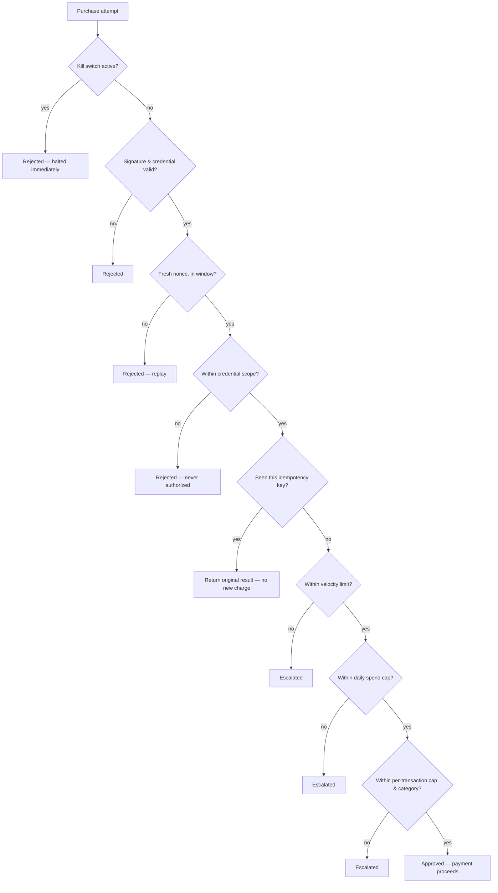

<div align="center">

# Setu

**Two AI agents that negotiate a real price and pay for it — with a trust layer that can prove, cryptographically, that it did the right thing.**

*A hackathon project, built in a few days. Not affiliated with any existing company or product also named "Setu."*

[](https://setu-alpha-beige.vercel.app)
[](https://setu-59l6.onrender.com/health)
[](docs/TESTING.md)
[](LICENSE)

[Live demo](https://setu-alpha-beige.vercel.app) · [Architecture](docs/ARCHITECTURE.md) · [Threat model](docs/THREAT_MODEL.md) · [Bargaining strategy](docs/BARGAINING.md)

</div>

<!-- TODO: replace with a real screenshot or short GIF of the hero + live negotiation feed -->


---

## What this is

Most "AI agent commerce" demos either fake the negotiation (an LLM freestyles a number) or fake the trust ("trust us, it's safe"). Setu does neither:

- A **Buyer Agent** and a **Merchant Agent** actually negotiate price using **Zeuthen's monotonic concession protocol** — deterministic game-theory math, not an LLM guessing a plausible number. The LLM only turns each round's already-decided numbers into a natural-language sentence for the chat log; it can never move the price. See [`docs/BARGAINING.md`](docs/BARGAINING.md).
- Every purchase — automated or human-triggered — passes through **`TrustGuard`**, a single choke point running 8 independent, ordered safety checks (kill switch, signature/replay defense, credential scope, idempotency, velocity limits, daily spend cap, per-transaction cap, category policy) before a single paisa moves. Every rule is **live-verified against production**, not just unit-tested — see [`docs/THREAT_MODEL.md`](docs/THREAT_MODEL.md) and [`BUILD_LOG.md`](BUILD_LOG.md) for real request/response transcripts.
- Payments are **real Razorpay test-mode transactions** (Orders + Payments API) — not a mock.
- A completed purchase can produce a **signed, standalone-verifiable transaction certificate** — a receipt you can check without ever trusting our server. See [Verification certificates](#verification-certificates) below.

## Why it's different

| | Typical "AI negotiates" demo | Setu |
|---|---|---|
| Who sets the price | The LLM, freestyling | A deterministic Zeuthen bargaining engine ([`docs/BARGAINING.md`](docs/BARGAINING.md)) — reproducible, explainable, never hallucinated |
| What the LLM is trusted with | Everything, including the number | Only phrasing an already-decided offer as a sentence — a broken LLM call degrades the chat log, never the price |
| How "safe" is proven | A README claim | 8 independent trust checks, live-fired against the production deployment with real request/response evidence ([`docs/THREAT_MODEL.md`](docs/THREAT_MODEL.md)) |
| How a completed deal is proven | A database row you have to trust us about | A downloadable, Ed25519-signed certificate anyone can verify **offline**, with **no** call back to our server ([`verify_certificate.py`](verify_certificate.py)) |

## See it live

<!-- TODO: replace with a real screenshot of a completed negotiation chat + result card -->


**[setu-alpha-beige.vercel.app](https://setu-alpha-beige.vercel.app)** — pick a product and a budget (or hit "Surprise me"), and watch your own Buyer Agent negotiate against Setu's Merchant Agent in real time: a real two-party chat paced by each message's actual LLM latency, a live Zeuthen risk-of-conflict chart, and — once a deal closes — a real Razorpay test-mode Checkout you can complete yourself.

The dashboard also has three other tabs, all built from real data, nothing illustrative:

<!-- TODO: replace with a real screenshot of the Decision Trace / Test Results / Audit Log tabs -->


- **Decision trace** — the exact 8-step TrustGuard checklist for a given outcome, reconstructed from the backend's own response, never fabricated.
- **Test results** — real numbers from a 22-scenario, 37-call test harness run against the live production API (`backend/app/scripts/scenario_harness.py`), including deliberate rule-breach attempts.
- **Audit log** — every one of those 37 real HTTP calls, with real order numbers, timestamps, and durations.
- **Kill switch** — an actual admin-gated emergency stop wired into the live deployment, not a demo toggle.

## Verification certificates

<!-- TODO: replace with a real screenshot of the "Download verification certificate" button + copy on the result card -->


When a negotiated purchase actually completes, the result card offers **"Download verification certificate"** — a small JSON file containing the product, agreed price, transaction id, timestamp, and exactly which trust checks that specific transaction passed, signed with the same Ed25519 key the backend already uses to sign agent credentials (see [`docs/DECISIONS.md`](docs/DECISIONS.md), 2026-09-05).

The point: **you never have to trust our server to check it.** [`verify_certificate.py`](verify_certificate.py) (repo root) verifies the signature completely offline — no network call, no dependency on this backend being up or honest — using only the certificate's own embedded public key.

Real output, from an actual completed purchase — a live human click-through of a real Razorpay test-mode Checkout, not a synthetic example:

```bash
python verify_certificate.py path/to/certificate.json
```

```
Issuer:          setu-platform
Transaction ID:  pay_TY6AQ50iNNS6nZ
Product:         Mechanical Keyboard — Hot-swap, 65% (mechanical-keyboard-65)
Agreed price:    ₹3,499.00
Issued at:       2026-09-04T20:53:59.900620+00:00

✓ Valid — this certificate has not been altered
```

Change one character in that same downloaded file and re-run it:

```
✗ Invalid — signature does not match
```

## Architecture


Read it as one sentence: **you** pick a product and budget, your **Buyer Agent** negotiates against the **Merchant Agent** using deterministic math (the LLM only phrases the sentence, never sets the price), and once a deal clears **TrustGuard**'s checks, a real **Razorpay** payment happens and you get back a **signed certificate** you can verify yourself, offline, without trusting this backend at all.

Deeper diagrams (component call sequence, raw data flow, deployment topology): [`docs/ARCHITECTURE.md`](docs/ARCHITECTURE.md).

## Tech stack

| Layer | Choice |
|---|---|
| Backend | Python, FastAPI, Pydantic, `uvicorn` — deployed on Render |
| Frontend | React 18, Tailwind CSS, Framer Motion — deployed on Vercel |
| Payments | Razorpay test-mode (Orders + Payments API) |
| LLM | Gemini (free tier), behind a provider-agnostic interface — phrasing and bounded upsell copy only, never the negotiated price |
| Crypto | `cryptography` (Ed25519) — agent identity, credentials, and transaction certificates all share one signing convention |
| Testing | `pytest`, `hypothesis`, a black-box HTTP scenario harness run against the live production API |

## Quickstart

```bash
git clone <this-repo>
cd setu
cp .env.example .env   # fill in Razorpay test keys + Gemini API key
make install
make test               # run the backend test suite (140 tests)
make run                 # start the FastAPI backend on :8001
make demo               # end-to-end Razorpay test-mode payment (needs real keys in .env)
```

Frontend dev server (separate terminal):

```bash
cd frontend && npm install && npm run dev   # :5173
```

Verify a downloaded certificate (no server, no install beyond `requirements.txt`):

```bash
python verify_certificate.py path/to/certificate.json
```

## Project structure

```
backend/app/
  buyer_agent/       Buyer Agent: product matching, negotiation, payment
  merchant_agent/     Merchant Agent: x402 quotes, upsells, payment verification
  bargaining/         Zeuthen bargaining engine — pure, deterministic, no LLM
  trust/              TrustGuard: identity, credentials, policy, velocity,
                       idempotency, daily spend, kill switch
  x402/                Razorpay-adapted x402 protocol subset
  llm/                 Provider-agnostic LLM client + latency/cost logging
  certificate.py       Signed transaction certificates
  checkout_quote.py    Short-lived signed tokens binding a negotiated price
                       to a real Razorpay Checkout order
  scripts/              Scenario test harness, local demo scripts
frontend/src/
  components/          Dashboard: hero, live negotiation feed, chat replay,
                       decision trace, kill switch, audit log
  lib/                  Shared formatting/classification helpers
verify_certificate.py  Standalone, offline certificate verifier
docs/                   Architecture, threat model, bargaining strategy,
                       protocol spec, deployment, testing, decision log
```

## Trust layer, in one picture



Every one of these is checked in this exact order, short-circuiting at the first failure — no partial approvals. Every rule has been fired **against the live production deployment**, with the real request/response transcripts recorded in [`BUILD_LOG.md`](BUILD_LOG.md) and summarized in [`docs/THREAT_MODEL.md`](docs/THREAT_MODEL.md).

## Testing & live verification

- `pytest backend/tests -v` → **140/140 passing** locally.
- A black-box scenario harness (`backend/app/scripts/scenario_harness.py`) ran 22 named scenarios (37 real HTTP calls) against the **live production API** — comfortable-budget purchases, tight-budget multi-round negotiations, no-match graceful failures, and deliberate rule-breach attempts (credential scope, velocity, daily spend, duplicate idempotency keys). Results are checked into `backend/app/scripts/harness_results/*.jsonl` and surfaced live in the dashboard's Test Results/Audit Log tabs.
- Every `TrustGuard` rule — kill switch, signature/replay, credential scope, idempotency, velocity, daily spend cap, spend cap, category — has been independently fired against production with real request/response evidence, not just asserted in a unit test. Full transcripts in [`BUILD_LOG.md`](BUILD_LOG.md); see [`docs/TESTING.md`](docs/TESTING.md) for how to reproduce.

## Known limitations

Being upfront about this, since it's a compressed hackathon build:

- Single-process, single-instance deployment — trust-layer state (idempotency store, velocity counters, nonce cache) is in-memory, not yet backed by a shared store like Redis/Postgres.
- The negotiation engine holds both parties' reservation prices in one process rather than each agent inferring the other's from observed offers alone — see "What this does not model" in [`docs/BARGAINING.md`](docs/BARGAINING.md).
- Admin kill-switch auth is a single shared static key, adequate for a single-operator demo, not per-operator auth in a real deployment.
- Test-mode payments only — live-mode is structurally supported but intentionally blocked in code today (`config.py`).

Full, continuously-updated list: [`docs/THREAT_MODEL.md`](docs/THREAT_MODEL.md) → "Known gaps."

## Docs

- [`docs/ARCHITECTURE.md`](docs/ARCHITECTURE.md) — system overview, component & data-flow diagrams, deployment topology
- [`docs/THREAT_MODEL.md`](docs/THREAT_MODEL.md) — assets, threats, defenses, live-verification evidence
- [`docs/BARGAINING.md`](docs/BARGAINING.md) — the Zeuthen strategy, in full, with the actual math
- [`docs/PROTOCOL.md`](docs/PROTOCOL.md) — the x402 subset, in detail
- [`docs/DEPLOYMENT.md`](docs/DEPLOYMENT.md) — how it's deployed
- [`docs/TESTING.md`](docs/TESTING.md) — how to run and reproduce every test
- [`docs/DECISIONS.md`](docs/DECISIONS.md) — a running log of non-obvious decisions and why
- [`BUILD_LOG.md`](BUILD_LOG.md) — the full day-by-day build log, including every live-verification transcript

## License

MIT — see [`LICENSE`](LICENSE).
