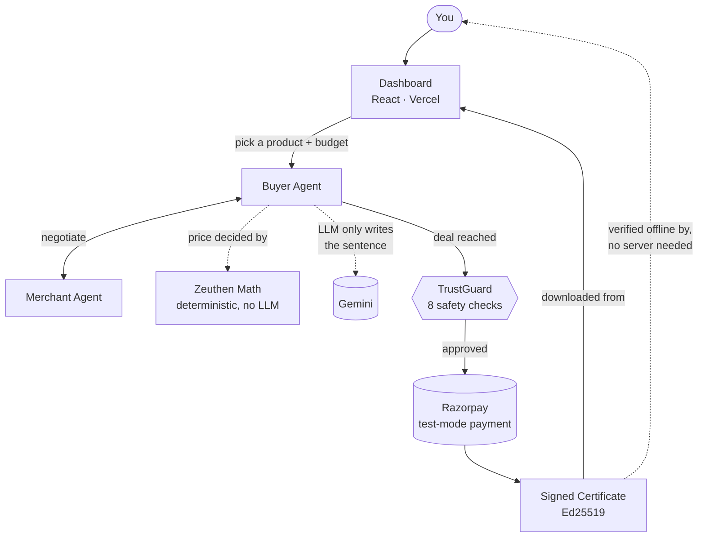
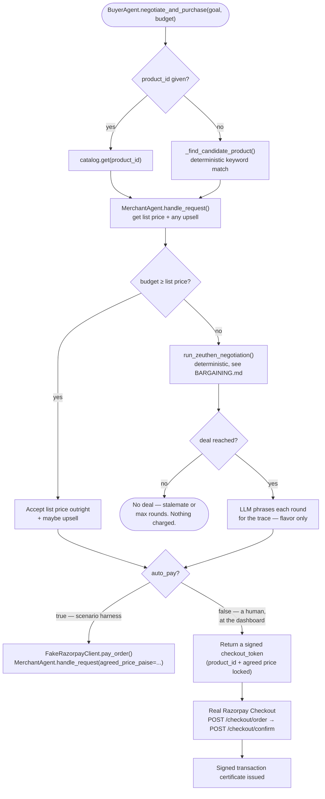
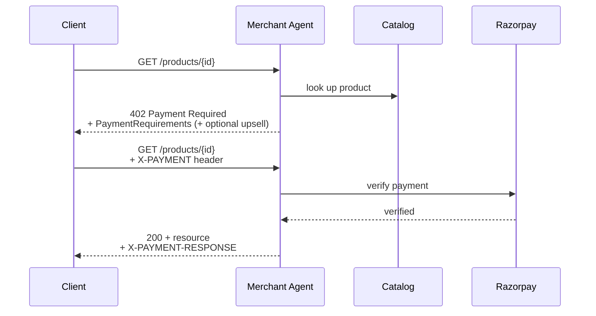
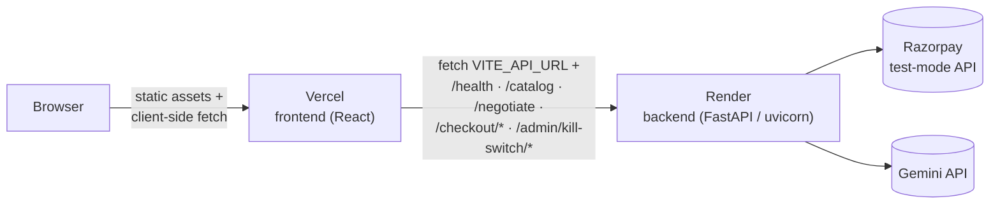

# ARCHITECTURE.md

> Status: Foundation + Merchant Agent + Buyer Agent + Zeuthen bargaining +
> TrustGuard (kill switch, signature/credential/replay, velocity, daily
> spend, policy bounds) + public dashboard + real Razorpay Checkout for
> human-triggered deals + signed transaction certificates, all live-deployed
> (frontend/CI aside — see `BUILD_LOG.md` for what's committed) and
> real-data-verified, including a real human click-through of both the
> Checkout flow and the certificate download (2026-09-05, Day 6). See
> `BUILD_LOG.md` (Day 4 Part 4) for the dashboard's interactive negotiation
> form, live chat replay, and hero/nav rework, and Part 3 for the
> dashboard's original build.

## Architecture at a glance

Read it as one sentence: **you** pick a product and budget in the **dashboard**, your **Buyer Agent** negotiates against the **Merchant Agent** using deterministic math (the LLM only phrases the sentence, never sets the price), and once a deal clears **TrustGuard**'s checks, a real **Razorpay** test-mode payment happens and you get back a **signed certificate** you can verify yourself, offline, without trusting this backend at all.

The sections below go one level deeper — the actual function-call sequence, the raw HTTP data flow, and where each piece is deployed.

## System overview

- **Backend**: FastAPI service (`backend/app`), packaged as `backend.app.*`.
  Deployed on Render.
- **Frontend**: React + Tailwind + Framer Motion dashboard (`frontend/`,
  see `src/App.jsx` and `src/components/`). A real single-page dashboard,
  not a placeholder: a sticky header/nav over a product-first hero, a
  "How it works" section, a live negotiation feed where a visitor either
  picks their own budget + catalog product or fires a random tight-budget
  scenario (`LiveFeed.jsx`) against the real `POST /negotiate`, replayed as
  a WhatsApp-style two-party chat paced by each message's real LLM latency
  (`NegotiationChat.jsx`) with a Zeuthen risk-of-conflict chart, a
  TrustGuard decision-trace panel, the Part 2 scenario-harness's real
  headline numbers and audit log, and a working kill switch against
  `/admin/kill-switch/*` (in a "system status" position near the audit
  log/footer, not the primary hero flow). Deployed on Vercel — see
  `BUILD_LOG.md` (Day 4 Part 3 for the original build, Part 4 for the
  interactive form/chat replay/hero rework) for what's built and one
  pending backend deploy needed for full fidelity.
- **Payments**: Razorpay test-mode (Orders + Payments API), via
  `backend/app/razorpay_client.py`.
- **LLM**: Gemini (free tier), behind a provider-agnostic interface
  (`backend/app/llm/base.py`) so the provider can be swapped without
  touching agent logic.
- **Protocol**: x402 subset (`backend/app/x402/`) — see `PROTOCOL.md`.
- **Merchant Agent**: `backend/app/merchant_agent/` — catalog-backed, speaks
  x402, offers bounded upsells, exposes a Zeuthen negotiation party
  (`negotiation_party()`) and verifies payment against either catalog list
  price or a prior negotiated price (`handle_request(..., agreed_price_paise=)`).
- **Buyer Agent**: `backend/app/buyer_agent/` — matches a catalog product to
  a free-text goal + budget (deterministic keyword match), either accepts
  list price outright (budget comfortable) or runs a Zeuthen negotiation,
  then pays via the fake Razorpay client and re-requests the resource with
  an `X-PAYMENT` header at the agreed price.
- **Bargaining (Zeuthen strategy)**: `backend/app/bargaining/zeuthen.py` —
  pure, deterministic utility/risk/concession math, no LLM. See
  `docs/BARGAINING.md` for the full writeup.
- **Fake Razorpay client**: `backend/app/fake_razorpay.py` — in-memory
  order/payment simulation for unattended automated flows (negotiation loop,
  tests). The real `RazorpayClient` also backs the dashboard's
  human-triggered checkout (`auto_pay=false`, `POST /checkout/order` +
  `POST /checkout/confirm`) and the one-off live-integration demo
  (`make demo`) — see `docs/DECISIONS.md`, 2026-09-02 and 2026-09-05.
- **Checkout tokens**: `backend/app/checkout_quote.py` — a short-lived,
  HMAC-signed token binding `(product_id, agreed_price_paise)` the moment a
  human-triggered negotiation actually closes, so `/checkout/order` and
  `/checkout/confirm` can never be pointed at a tampered price.
- **Transaction certificates**: `backend/app/certificate.py` — once a
  human-triggered checkout completes, a small Ed25519-signed certificate
  (product, price, transaction id, timestamp, trust checks passed) is
  returned for download, verifiable completely offline via
  `verify_certificate.py` (repo root) — see `docs/DECISIONS.md`,
  2026-09-05.
- **LLM call logging**: `backend/app/llm/logging_client.py` — wraps any
  `LLMClient`, records latency + estimated token cost per call.
- **Policy/trust layer**: `backend/app/trust/` — `TrustGuard`
  (`guard.py`) is the single choke point every purchase passes through:
  kill switch, signature/credential verification, replay defense
  (`identity.py`), credential-scope check, idempotency (`idempotency.py`),
  velocity (`velocity.py`), daily spend cap (`daily_spend.py`), and policy
  bounds (`policy.py` — spend cap, category). One `TrustGuard` instance is
  shared across every agent in the process, so the kill switch and
  velocity/spend accounting are genuinely global across `/negotiate` and
  `/products/{id}`. Every rule is live-verified against production — see
  `BUILD_LOG.md`'s Day 4 entries and `docs/THREAT_MODEL.md`.

## Component diagram

The actual function-call sequence behind one `negotiate_and_purchase(goal, budget)` call — including both ways a deal turns into a real payment (`auto_pay=true` for the scenario harness, `auto_pay=false` for a human at the dashboard):

## Data flow (today)

## Deployment topology

CORS on the backend (`backend/app/config.py: cors_allowed_origins`) allows
only the Vercel origin and `localhost:5173` — see `THREAT_MODEL.md`. Full
walkthrough in `DEPLOYMENT.md`.
